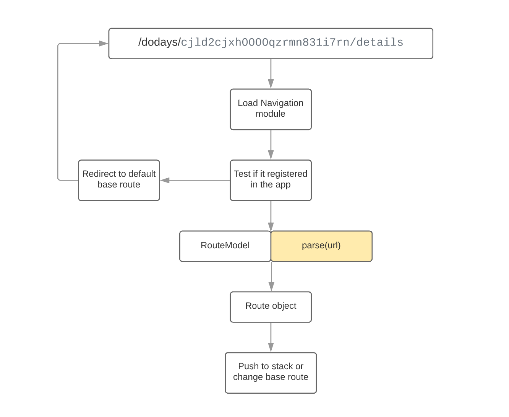
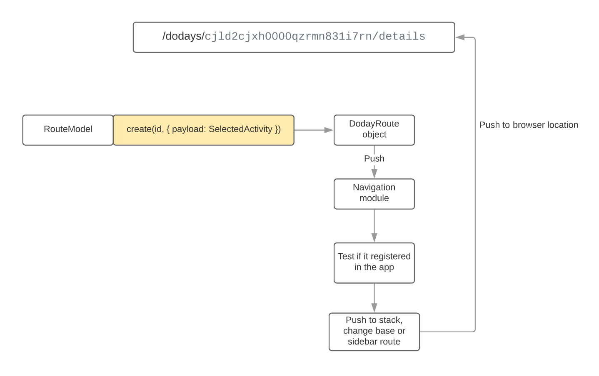

# [:Core] Navigation module

In `Doday` we don't use React router since we need Navigation stack.

For this purpose was create `Navigation module`.

### How it works

Each route must be registered in the system and described using the `RouteModel` interface. **Any module** can register a new **route**. After registration, the route becomes **recognizable** by the system and participates in navigation. There are 3 main types of routes in the system - `base`, `stacked` and `sidebar` routes.

#### Base Route

Changes the application page as on a regular website, replacing the previous base route. (When changing the base route, the navigation stack will be cleared)

#### Stack route

A route that is pushed into the navigation stack and the view provided for the route is located on top of the base route.

#### Sidebar route

Routes used only for part of the layout - sidebar. In the mobile version of the sidebar application, the routes behave as **base** routes, since the views for the sidebar in the mobile version are displayed on the whole screen.

In order to provide a view for particular route, you must use the `NavigationRoute` component.

His job is to verify the passed route as a `path` prop for compliance with the state of the navigation module.

You can specify for which type of route you provide the view - base, stacked or sidebar (accordingly, the component will check the provided `path` with the corresponding piece of the navigation state)

```javascript
<NavigationRoute stacked path={routes.builder.pattern}>
  {(route, zIndex) => {
    return (
      <Spot
        spot={BaseStackSpot.Builder}
        node={route.params.sysname}
        moduleTypes={[ModuleType.Tool]}
        style={{ zIndex }}
      />
    );
  }}
</NavigationRoute>
```

### Shape of the registered `RouteModel` object:

```javascript
{
  /**
   * Sysname of the new route
   */
  sysname: string;
  /**
   * Path for the new route, for example `/dodays/:id/details
   */
  path: string;
  /**
   * Type of the new route - Base, Stacked or Sidebar
   */
  type: RouteType;
  /**
   * RegExp object to test route for compliance
   */
  pattern: RegExp;
  /**
   * Helper function to create `Route` to use it for navigation
   */
  create: (...params: string[]) => DodayRoute;
  /**
   * Helper function to parse some url to this Route object
   */
  parse: (path: string) => Route;
  /**
   * Sysname of the Module that provides this route
   */
  provider: ModuleSysname;
}
```

After the new route is registered, you can use it in the app. In the app we operate the `Route` object.

### Shape of the `Route` object:

```javascript
{
  /**
  * Same as in `RouteModel`
  */
  path: string;
  /**
  * Base of the route (without params and query)
  */
  base: string;
  /**
  * Parsed `params` from url, for example { id: string; }
  */
  params?: { [key: string]: string };
  /**
  * Query params from url string
  * For example url like -
  * '/store?node=Activity&duration=60M'
  * Will be parsed to { node: Activity, duration: 60M }
  */
  query?: { [key: string]: string };
  /**
  * Payload attached to this route
  * Same as `State` in the ReactRouter
  */
  payload?: any;
  /**
  * Full url string
  * For example, '/store?node=Activity&duration=60M'
  */
  url: string;
}
```

### Logic schema

Let's take a look how it works when user initially enters route in the browser location:



Second case when the user just use our UI to change route:


