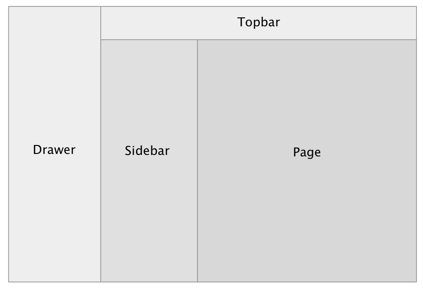

# Layout

`Layout` module provides the main ways of communication with the user and base layout spots for other modules.

Supports desktop and mobile layouts.

## Layout spots

`Layout` module provides six base layout spots:

- **LayoutSpot.Drawer** - collapsible spot for drawer menu
- **LayoutSpot.Topbar** - top bar spot
- **LayoutSpot.Sidebar (desktop only)** - collapsible sidebar spot for sidebar apps.
- **LayoutSpot.Page** - page spot for main content of the app
- **LayoutSpot.SpeedDial** - spot for speed dial button
- **LayoutSpot.BottomNavigation (mobile only)** - spot for mobile bottom navigation

Other modules placed in these base spots could provide **additional spots** inside itself.
